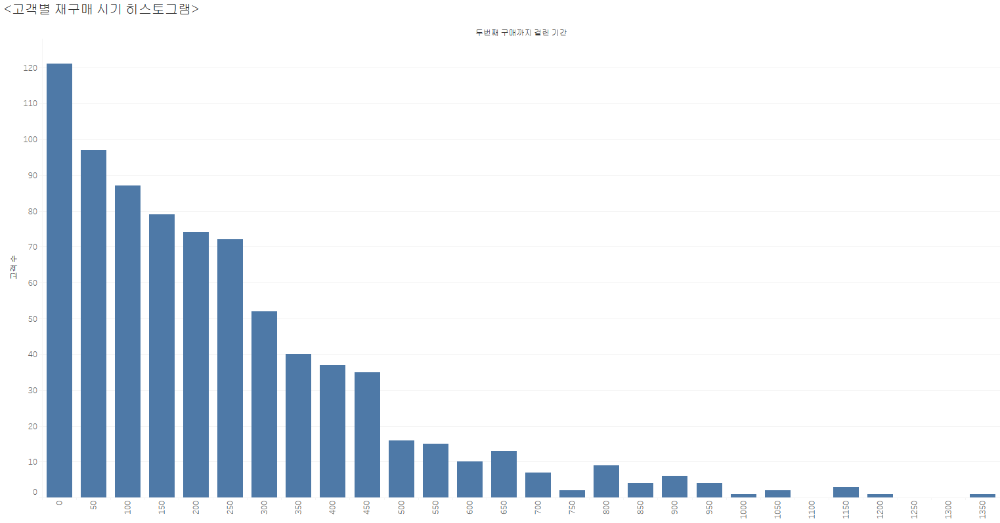
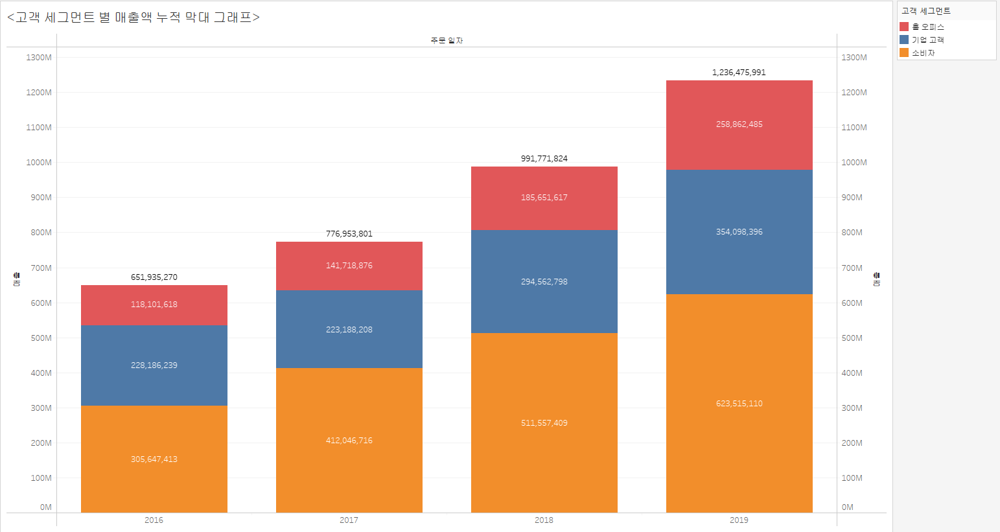
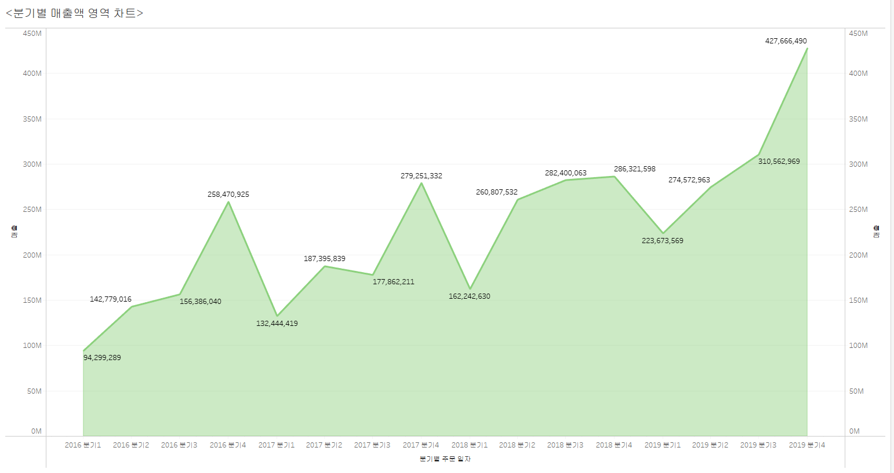
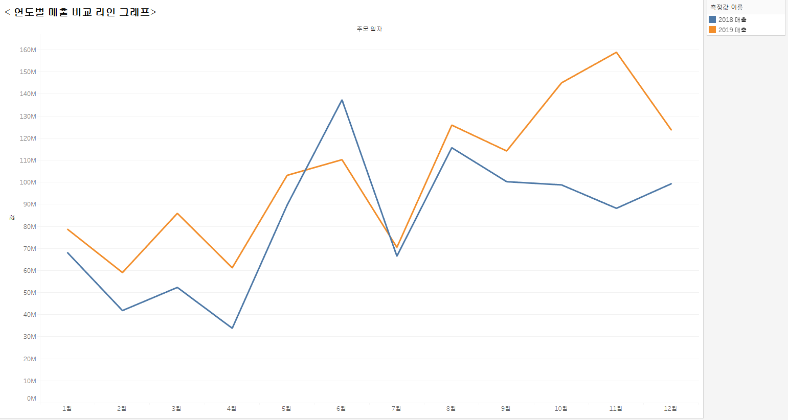
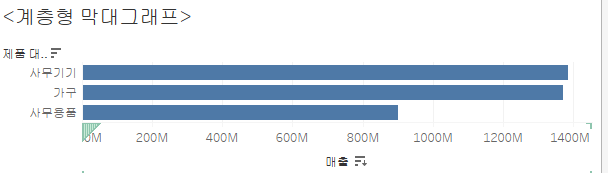

# visualization

# 태블로 시각화

## 1. 고객별 재구매 시기 히스토그램

## 2. 고객 세그먼트별 연간 매출액 추이 라인+버블그래프

## 3. 고객 세그먼트 별 매출액 누적 막대 그래프
 

## 4. 분기별 매출액 영역 차트

## 5. 연도별 매출 비교 라인 그래프

## 6. 계층형 막대그래프

## 5. 연도별 매출 비교 라인 그래프

