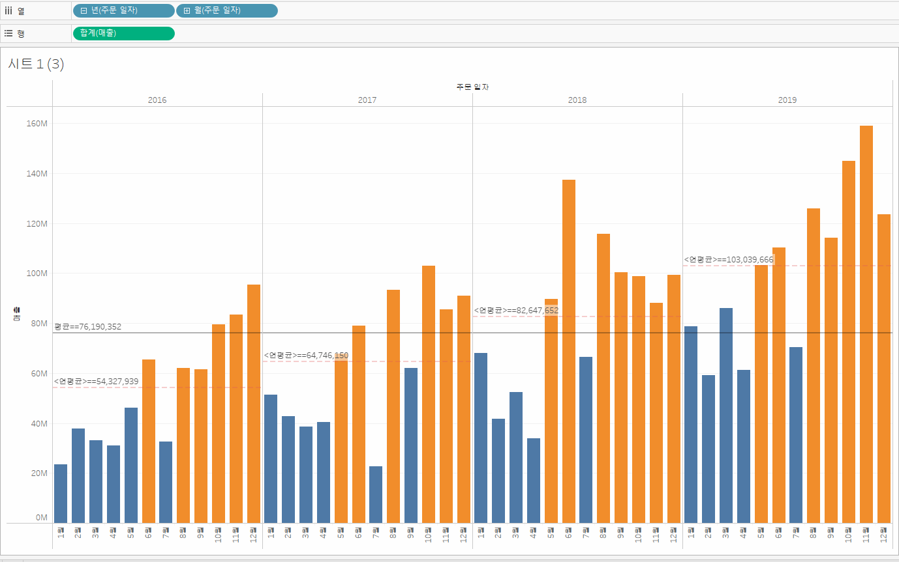
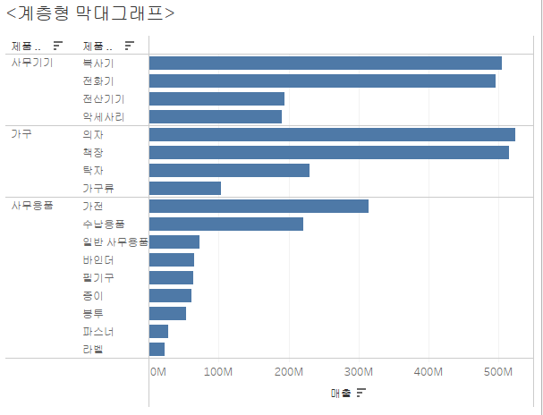

# visualization

# 태블로 시각화

## 1. 고객별 재구매 시기 히스토그램

## 2. 고객 세그먼트별 연간 매출액 추이 라인+버블그래프

## 3. 고객 세그먼트 별 매출액 누적 막대 그래프
 

## 4. 분기별 매출액 영역 차트

## 5. 월별 매출액 라인 그래프 년도 비교

## 6. 지역별 매출총액 라운드형 막대 그래프

## 7. 평균라인이 있는 막대 그래프

## 7. 제품별 계층형 막대그래프1

## 8. 지역별 계층형 막대그래프2

## 9. 계층형 지도그래프

## 10. 평균 수익에 따른 서울시 지도 그래프

## 12. 전국 수익 및 수량 버블 지도 그래프

